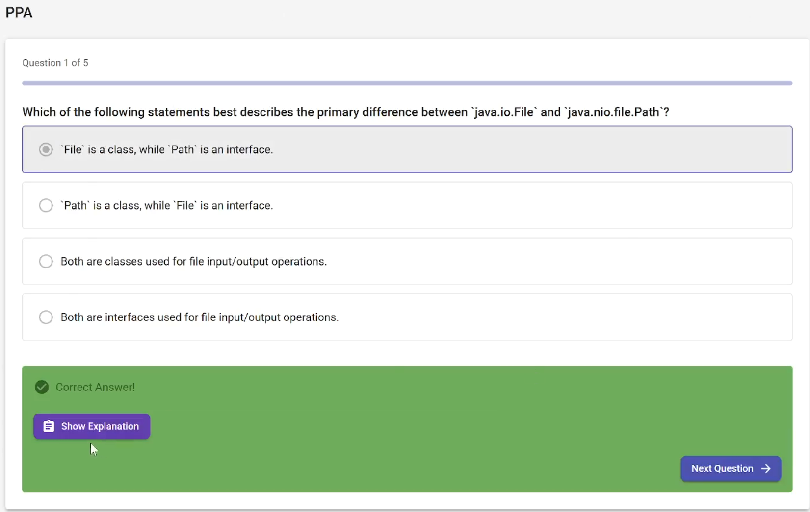
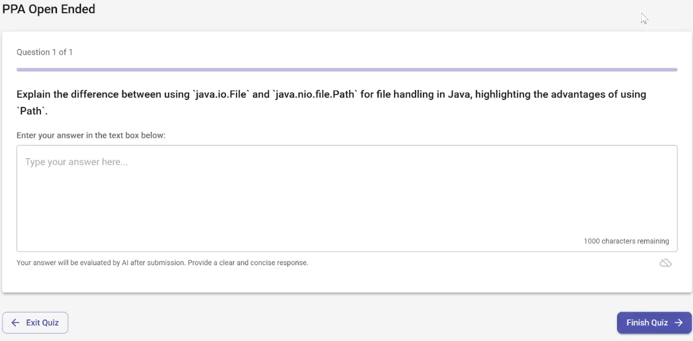
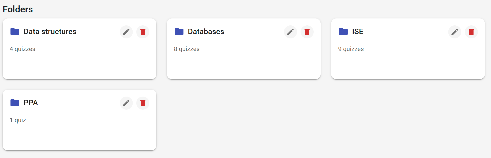
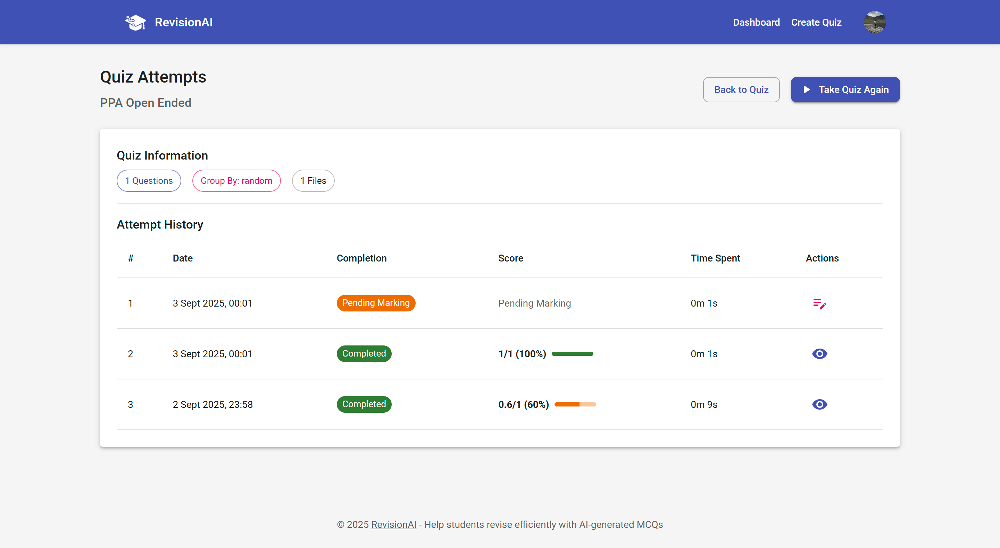
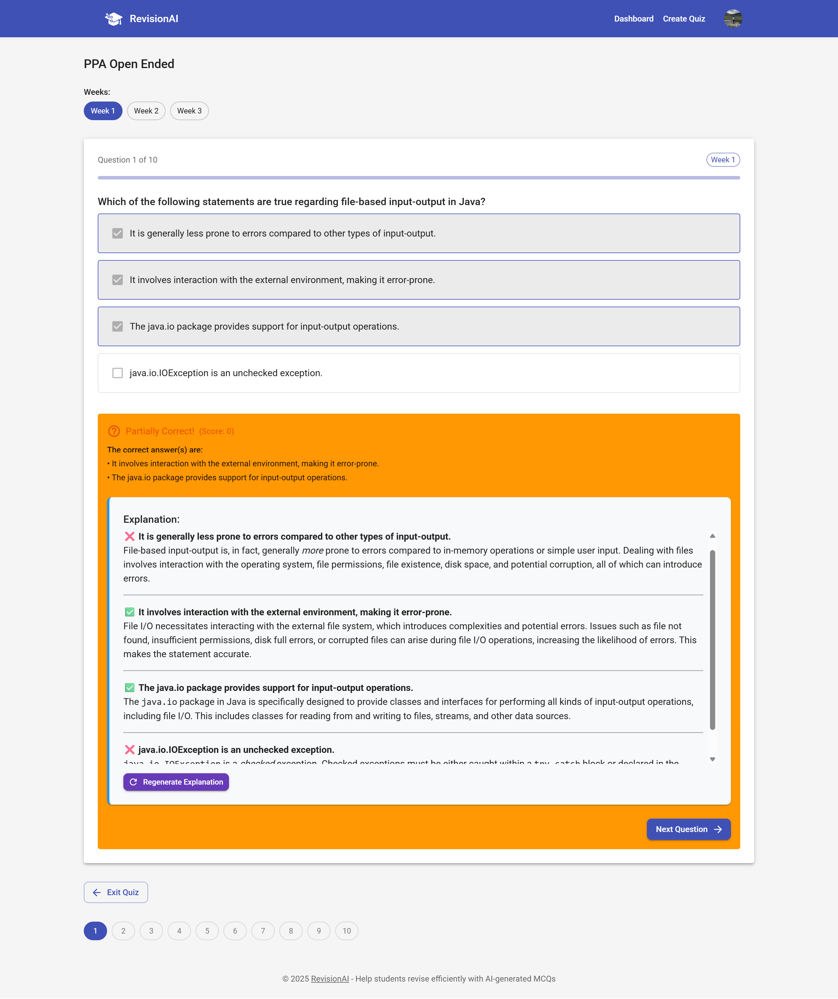
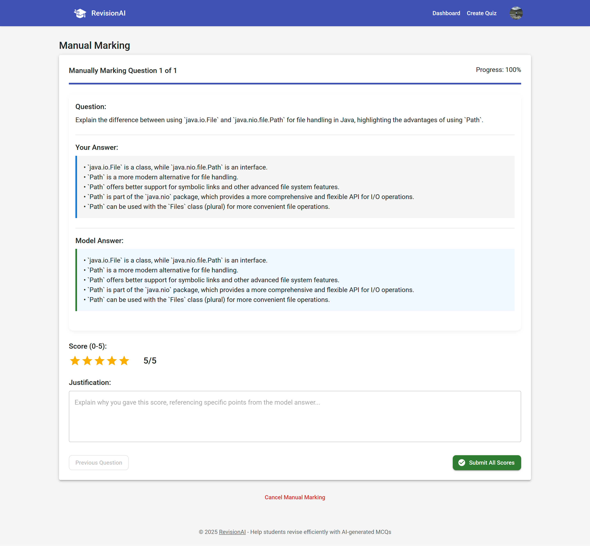
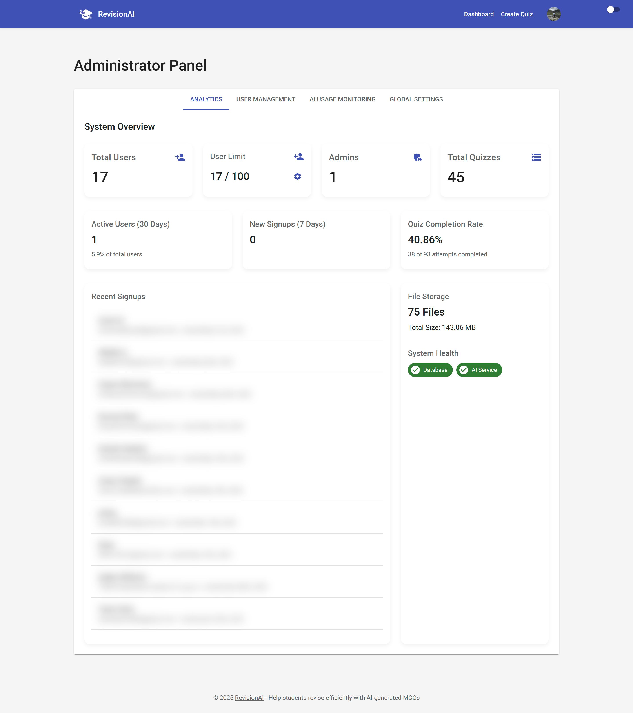
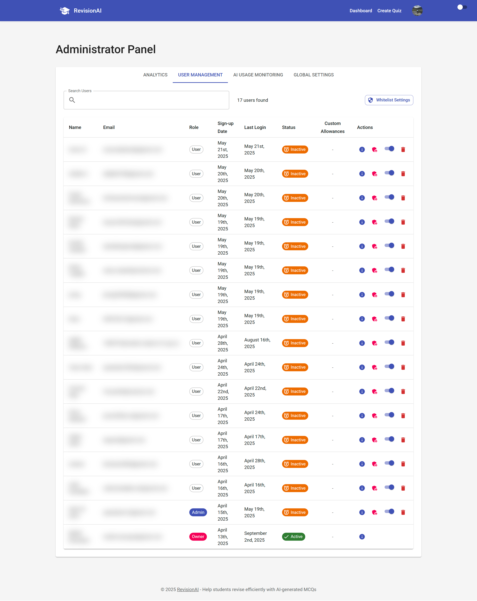
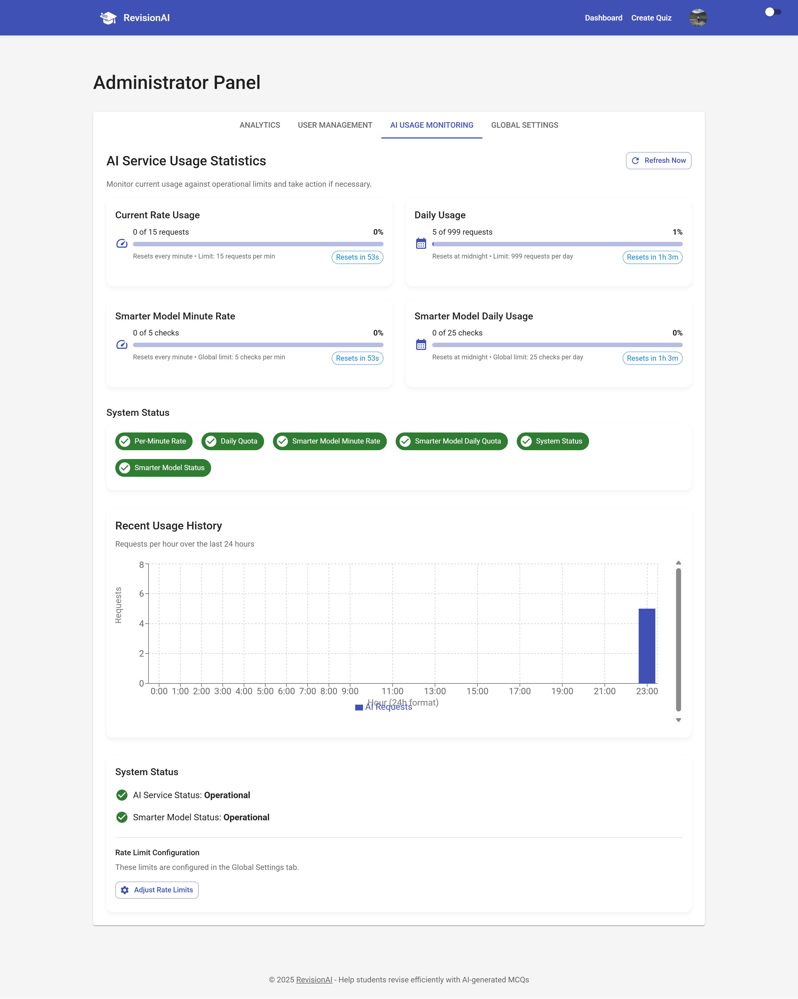
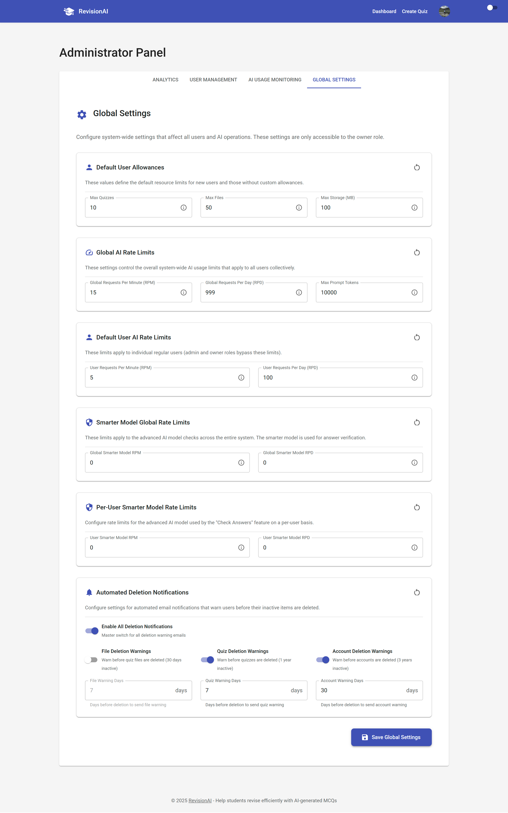

# RevisionAI - AI-Powered Quiz Generation Platform

**RevisionAI** is a full-stack web application that helps students revise more effectively by automatically generating multiple-choice and open-ended questions from their own coursework using the Google Gemini API.

> **Beta Notice**
>
> Please note that RevisionAI is currently in a public beta phase. The application is under active development, and while it is fully functional, you may occasionally encounter bugs or temporary performance issues. Feedback and bug reports are greatly appreciated!

---

## 🚀 Live Application & Video Walkthrough

This project is publicly deployed and available for anyone to use.

*   **Live Application:** **[➡️ Visit RevisionAI Now](https://revisionai.justlearning.net/)**

*   **Core Feature Showcase (Videos):**

| MCQ Quiz Workflow | Open-Ended Quiz & AI Marking Workflow |
| :----------------------------------------------------------: | :------------------------------------------------------------------: |
|  |  |
| A complete walkthrough from creating a quiz, uploading materials, generating MCQs, taking the quiz with per-question feedback, and requesting AI explanations. | A demonstration of creating an open-ended quiz, AI-generating model answers, taking the quiz, and using the AI Marking feature to get a graded score and justification. |

---

## ✨ Core Features

*   **AI-Powered Question Generation:** Upload study materials (PDF, DOCX, TXT, or ZIP archives) and automatically generate relevant MCQs or Open-Ended questions using Google Gemini.
*   **Dual Quiz Styles:**
    *   **MCQ:** Classic multiple-choice questions.
    *   **Open-Ended:** Questions requiring detailed, free-text answers with AI-powered marking.
*   **Folder Organisation System:** Create, rename, and delete folders to intuitively manage and categorise quizzes.
*   **Advanced Quiz Taking:**
    *   Interactive sessions with optional timers and shuffling of options.
    *   **Negative Marking:** A challenging mode with proportional scoring for questions with multiple correct answers.
    *   **Persistent Attempts:** Progress is automatically saved, allowing users to resume incomplete quizzes.
*   **AI-Assisted Learning:**
    *   **AI Explanations:** Request detailed, AI-generated explanations for any question during quiz review.
*   **Comprehensive Admin Panel:**
    *   **Analytics Dashboard:** View system-wide statistics on users, quizzes, and files.
    *   **User Management:** Manage user roles, status (active/blocked), and view individual activity.
    *   **AI Usage Monitoring:** Track real-time global AI consumption against rate limits.
    *   **Global Settings (Owner-only):** Configure system-wide defaults, user allowances, and AI rate limits.
*   **Whitelist & Maintenance Mode:** Securely restrict application access for beta testing or system updates, ensuring administrators retain access.

---

## 💎 Advanced Feature Highlight: AI Answer Verification

> **Note:** This feature is fully implemented in the codebase but is **disabled on the live website** to manage the operational costs associated with premium AI models.

RevisionAI includes a powerful answer verification system for MCQ quizzes that acts as an expert quality check. This feature utilises a more advanced, reasoning-focused AI model (**Google's Gemini 2.5 Pro**) to validate the correctness of quiz answers.

#### Why a Smarter Model?
Unlike question generation where the AI has the source text for context, answer verification requires the AI to use its own general knowledge to assess if a marked answer is correct. This is a more complex task that necessitates a more powerful model.

#### The Workflow
1.  A user clicks **"Check Answers"** on an MCQ quiz.
2.  The backend sends the questions to the Gemini 2.5 Pro model.
3.  The AI analyses each question and returns a structured JSON response containing:
    *   **Proposed Corrections:** For any answers it identifies as incorrect.
    *   **Unsure Flags:** For questions where it lacks the context to make a confident judgment.
    *   **Justifications:** A clear explanation for every proposed change.
4.  The frontend presents these findings in a clear results dialogue, allowing the user to review and apply the suggested corrections.

This feature significantly improves quiz quality and demonstrates a sophisticated, multi-model AI integration strategy.

---

## 📸 Gallery

| Dashboard & Folders | Attempt Results & Explanations |
| :---: | :---: |
|  |  |
| The main dashboard provides a clean overview of user-created folders and quizzes. | After a quiz, users get a detailed breakdown of their performance and can request AI explanations. |

| Taking a Quiz (Negative Marking) | Open-Ended Manual Marking |
| :---: | :---: |
|  |  |
| The quiz interface supports advanced modes like negative marking with immediate feedback. | A dedicated UI for manually marking or self-assessing open-ended questions against a model answer. |

| Admin Panel - Analytics | Admin Panel - User Management |
| :---: | :---: |
|  |  |
| The admin dashboard provides a powerful overview of system health and user engagement metrics. | Administrators can view, manage, and edit user roles and statuses from a central table. |

| Admin Panel - AI Usage | Admin Panel - Global Settings |
| :---: | :---: |
|  |  |
| Real-time monitoring of global AI rate limits and daily quotas to ensure system stability. | The application owner can configure all system-wide defaults and limits from a single interface. |

---

## 🛠️ Tech Stack & Architecture

This project is a full-stack application built with a modern MERN-style stack, designed for scalability and a rich user experience.

*   **Frontend:** React.js, Material-UI, React Router, Axios, React Context
*   **Backend:** Node.js, Express.js
*   **Database:** MongoDB with Mongoose
*   **AI:** Google Gemini API (`gemini-2.0-flash` for generation, `gemini-2.5-pro` for verification)
*   **Authentication:** Google OAuth 2.0 via Passport.js, with session management using JSON Web Tokens (JWT)
*   **File Processing:** Multer, `unzipper`, `pdf-parse`, `mammoth`

---

## 🔧 Technical Deep Dive

Here are some of the key technical implementations that power RevisionAI:

*   **Authentication Flow:** The system uses a robust authentication flow with Passport.js for Google OAuth 2.0. On successful callback, a secure JWT is generated and sent to the React client. This token is then used for all subsequent authenticated API requests via an Axios interceptor, which also handles automatic redirection on token expiration or server errors.

*   **AI Integration & Prompt Engineering:** Question generation is powered by the Google Gemini API. The backend constructs detailed, multi-part prompts that include a strict JSON schema. This ensures the AI returns structured, validated data for MCQs, Open-Ended questions, and their respective model answers. A separate, more advanced model is leveraged for the answer verification feature, which operates under its own, stricter rate limits.

*   **Open-Ended Question Lifecycle:** This feature represents a complete, complex workflow. It includes:
    1.  AI generation of questions *and* bullet-pointed model answers.
    2.  A quiz-taking interface with debounced auto-saving to prevent data loss.
    3.  A separate post-attempt marking step where users can choose between AI-powered grading or manual self-assessment.
    4.  A detailed results view that presents the score, AI justification, user answer, and model answer side-by-side.

*   **File Processing Pipeline:** User-uploaded files are handled by a multi-step pipeline using Multer. The system supports PDF, DOCX, TXT, and ZIP files. For ZIP archives, the `unzipper` library extracts files on the server, and text is then parsed from all supported formats before being sent to the AI. A dedicated `File` collection in MongoDB tracks every individual document to ensure accurate storage usage calculations.

---

## 🔒 Private Repository Notice

The source code for this project is hosted in a private repository to protect the intellectual property. This public repository serves as a detailed showcase of its features, architecture, and technical implementation.
